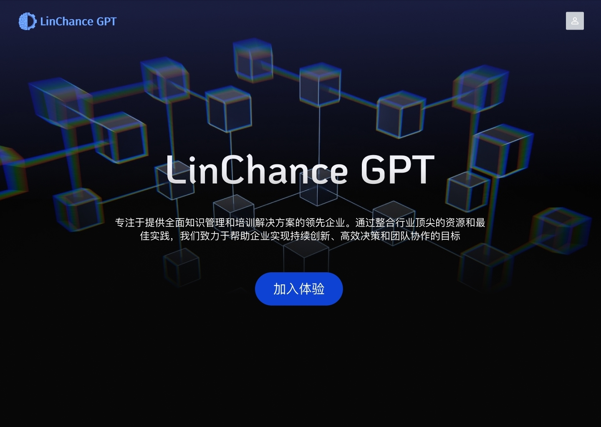
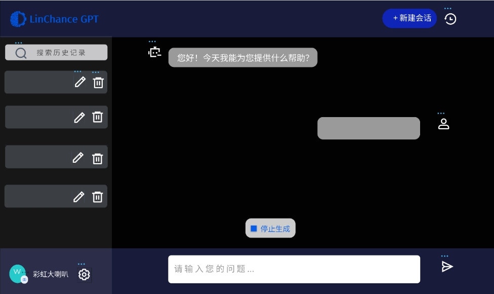
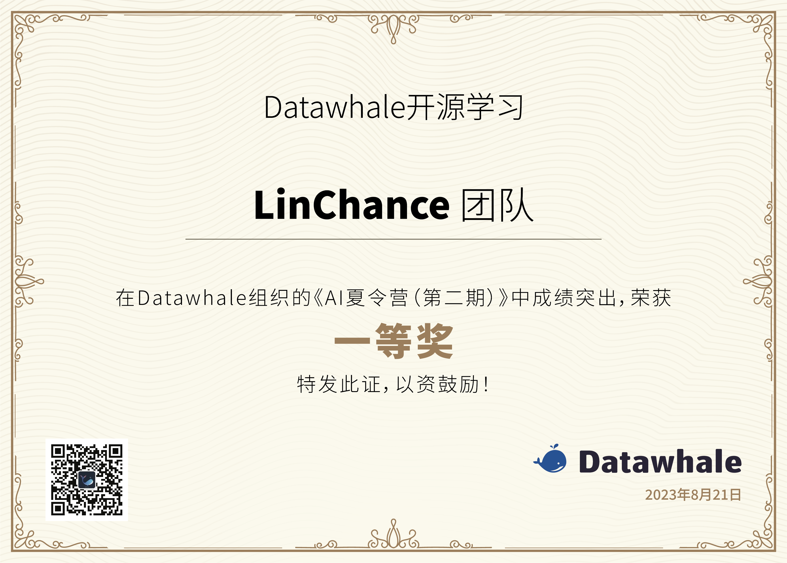
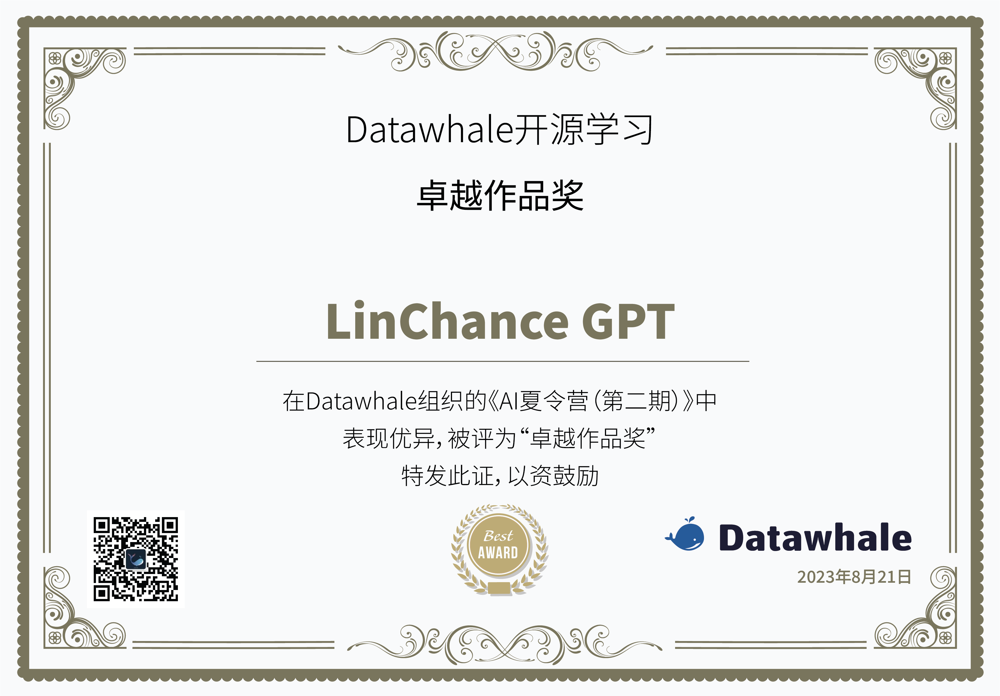
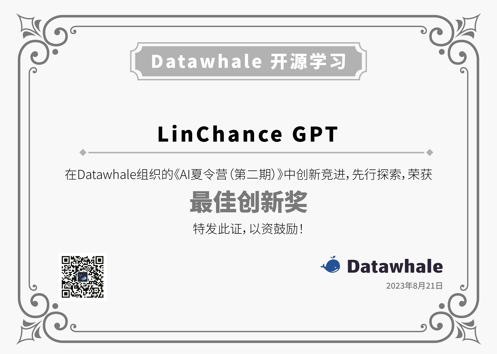
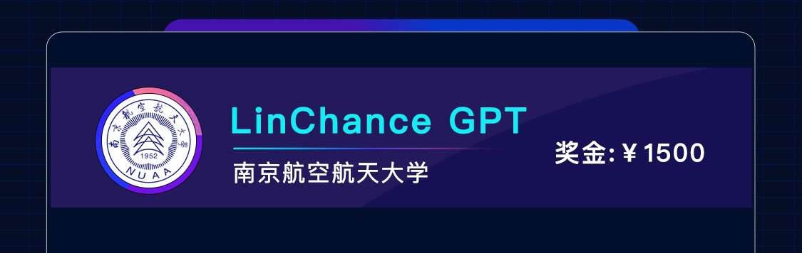

# LinChance_GPT

## 项目简介
本项目致力于打造数智化平台级智能人机交互产品，结合智能知识库和知识检索的功能，满足高效运行和优质服务的需求。

在项目立项阶段，我们通过深入的市场调研，发现现有竞品的优势与不足，并将企业内部人员的应用需求以及私有定制化数据库作为主导的开发方向。运用科学的功能设计原理，利用向量数据库（Milvus）、GPT模型和LangChain等技术手段，提升知识检索效率。

随着项目的不断优化，计划将其扩展到个人领域，构建个人知识体系，从而不断为企业和个人创造价值。

## 技术点
- GPT（ChatGPT、星火API等）
- Django4.2
- Vue3
- LangChain
- 向量数据库

## 核心功能
### 知识库管理          
**1. 知识点学习**
- 在Django中创建model，用于存储知识点、部门、职位、语言等信息，以及相关的数据。   
  - 根据不同部门不同职位分类      
  - 根据语言分类                
  - 根据知识点分类   
- Chat Message History：
  - 创建一个model来存储聊天消息的历史记录，包括用户输入和系统的响应。使用登录注册服务，可以为每个用户创建一个消息记录，然后在视图中处理消息的保存和检索。                
  - 生成文档历史记录，经过数据清洗处理后作为数据可以训练自己的大模型     
  
**2.  检索功能**
- 在Django中，创建代理（Agent）类，用于处理用户输入和决策。这个代理可以根据用户的查询调用不同的工具和功能。      
- Agent：Agent 是在 LangChain 中推动决策制定的实体。他们可以访问一套工具，并可以根据用户输入决定调用哪个工具。                 
  - 企业内部大模型             
  - 第三方大语言模型接口                
    - 星火
    - gpt3.5                
  - 可以通过Django的ORM（Object-Relational Mapping）来操作数据库，进行数据的查询、插入、更新和删除等操作，来调用本地的数据库。

### GPT问答页面
**1. 上下文语境**       
-  自动识别，确保高效问答 
  - Output Parsers（输出解析器）： 将响应与用户之前的交互上下文结合，生成连贯的对话流程。
  - Chat Message History   
             
**2. 用户提问描述支持**
- langchain（Prompt Templates and Values）
  - 可以定义一系列 Prompt Templates，这些模板是用户输入的预设形式    
  - 创建一个 PromptValues 类，这个类负责将用户的具体输入值填充到 Prompt Templates 中，生成最终传递给语言模型的内容。      
  - 将填充后的 Prompt Templates 传递给语言模型进行查询。语言模型将根据这些输入生成相关的回答。          
  - 从语言模型获得回答后，可以使用 Output Parsers 来将模型的响应构建为更有用的格式，例如将文本格式化为Markdown、HTML等，以便更好地呈现给用户。     
- 在 Prompts 中动态包含示例         
  - Example Selectors，想要在 Prompts 中动态包含示例时，Example Selectors 可以接受用户输入并返回一个示例列表以在提示中使用，使其更强大和特定于上下文。           
- 个性化推荐总结       
  - Chat Message History，ChatMessageHistory 类负责记住所有以前的聊天交互数据，然后可以将这些交互数据传递回模型、汇总或以其他方式组合。这有助于维护上下文并提高模型对对话的理解。
 
## 技术实现方案
**1. 数据存储和管理（向量数据库-后期支持）**
  - 使用向量数据库（ Milvus 等）或 Sqlite3 数据库来存储企业内部的知识库数据。向量数据库可以将文本数据转换为高维向量表示，并基于向量相似性进行高效的检索和匹配。
  - 将 GPT 接口训练得到的文本向量存储在向量数据库中，以便快速获取相关的问题和答案。
  - 使用 Pandas 等库在 Django 后端对数据进行规整化、标注和清洗。同时，使用 LangChain 提供的 API 接口与其他技术进行集成。

**2. 智能搜索和检索（实时搜索引擎-后期支持）**
  - 使用 GPT 模型（如 GPT-3.5、星火等）进行自然语言理解和生成，以理解用户的查询并生成智能回复。
  - 结合向量数据库的索引功能，实现快速的全文搜索和结果匹配。
  - 利用 GPT 模型和搜索引擎的查询功能，实现精确的搜索结果排序和过滤。

**3. 前后端分离开发**
  - 后端使用 Django4.2 框架进行开发，处理前端发送的请求并提供相应的数据。
  - 原型设计采用Figma 搭配 Arco Design System 构建美观大方的用户界面。
  - 前端使用 Vue3 框架搭配 Arco 组件与后端进行交互构建安全可靠的Restful API，展示用户界面，并发起搜索请求和显示智能回复。

**4. 智能客服功能实现**
  - 用户在前端界面提出问题后，将问题发送到后端API。
  - 后端使用Langchian 搭配 GPT 模型对用户提问进行理解和生成智能回复。

## 原型设计
- 首页
  ​​
- GPT问答页面  

  ​​
## 项目规划
### 前期（立项至原型设计完成）

**1. 市场调研与竞品分析**
  - 深入理解市场需求，识别目标用户。
  - 对现有竞品进行详尽分析，找出其优势与不足。
    
**2. 需求分析**
  - 需求调研和沟通，明确具体的功能点和定制化数据库需求。

**3. 技术选型与原型设计**
  - 确定使用Milvus、GPT模型和LangChain等技术进行项目开发。
  - 设计产品原型，包括界面布局、功能设计和交互流程。

**4. 团队分工与初步开发**
  - 根据功能需求进行团队分工，如上文所述分为前后端任务。
  - 开始进行部分核心功能的开发，如知识库的搭建和前端的初步设计。

### 中期（核心功能开发）

**1. 前端开发**
  - 完成文字气泡框的页面显示，和点击发送的前后端交互设计。
  - 设计页面初始提示词，实现后端回答的页面显示。
  - 优化历史记录的显示与交互，保证刷新后数据不丢失。
  - 设计新建会话功能，以便用户进行多个对话。

**2. 后端开发**
  - 实现prompt功能以供前端调用。
  - 结合Faiss和agent进行知识检索。
  - 编写API文档供前端团队参考。
  - 完成新建对话的命名和管理功能。
  - 优化中文文档在数据库中的存储和检索，确保向量数据库能高效回答。

### 后期（首次内测并优化）

**1. 内部测试**
  - 邀请项目成员对平台进行使用，并反馈意见。
  - 根据测试反馈挖掘功能优化点。

**2. 功能迭代与优化**
  - 根据内测反馈，不断优化产品功能。  
  
## 奖项荣誉

**1. Datawhale《AI夏令营（第二期）》一等奖**
  

**2. Datawhale开源学习卓越作品奖**
  

**3. Datawhale开源学习最佳创新奖**
    

**4. 2023百度搜索创新大赛 赛道三-AI应用设计 Top5**
    

## 贡献者

项目负责人：[李柯辰](https://github.com/Joe-2002)

邮箱：likechen@linchance.com

<table border="0">
  <tbody>
    <tr align="center">
     <td>
          
         <a href="https://github.com/Joe-2002">李柯辰</a> 
        
 南京航空航天大学 江苏霖承科技有限公司

      </td>
     <td>
          
         <a href="https://github.com/Ethan-2004">张海生</a>
         
南通师范高等专科学校 江苏霖承科技有限公司

      </td>
      <td>
          
         <a href="https://github.com/zhumengyu">朱梦雨</a> 
        
南通理工学院 江苏霖承科技有限公司

      </td> 
       <td>
          
         <a href="https://github.com/zhaojaiyi">赵嘉仪</a>
         
南通师范高等专科学校 江苏霖承科技有限公司

      </td>
    </tr>
  </tbody>
</table>
<table border="0">
  <tbody>
    <tr align="center" >
      <td width="190">
          
         <a href="https://github.com/zhangyi999-g">张艺琼</a>
         
北京大学

      </td>
      <td width="190">
          
         <a href="https://github.com/zzc-ccccc">曾紫翀</a>
         
悉尼科技大学

      </td>
      <td width="190">
          
         <a href="https://github.com/zheyuX">肖喆煜</a>
         
中国石油大学

      </td>
      <td width="190">
          
         <a href="https://github.com/Ava-vivian">张晋赫</a>
         
北京工业大学

      </td>
      <td width="190">
          
         <a href="https://github.com/imlhoy">林弘毅</a>
         
广东财经大学

      </td>
      <td width="190">
          
         <a href="https://github.com/Ahanyue">郑慧颖</a>
         
广东财经大学

      </td>
       <td width="190">
          
         <a href="https://github.com/Ahalfmoon">周旻萱</a>
         
南开大学

      </td>
    </tr>
  </tbody>
</table>

## 致谢

特别感谢以下为项目做出贡献的同学！

## Star History

